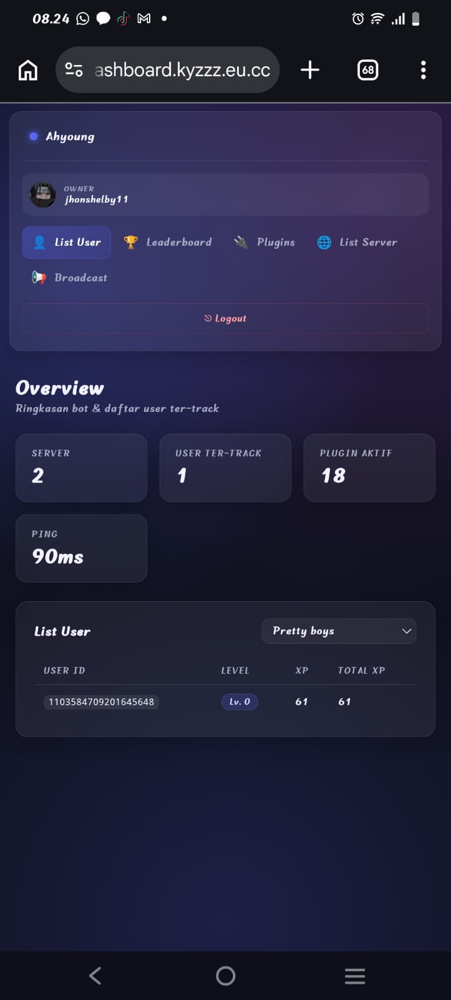
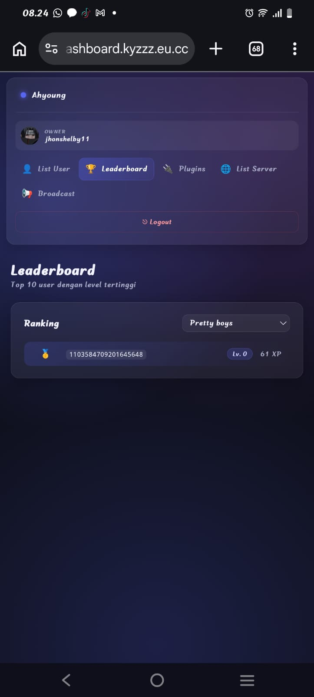
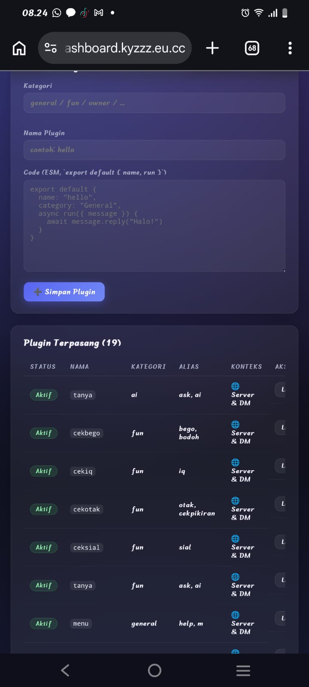
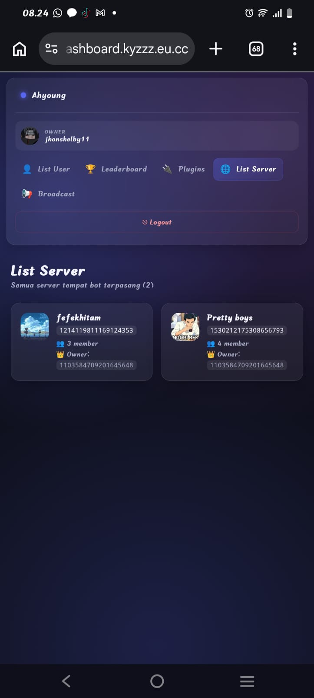
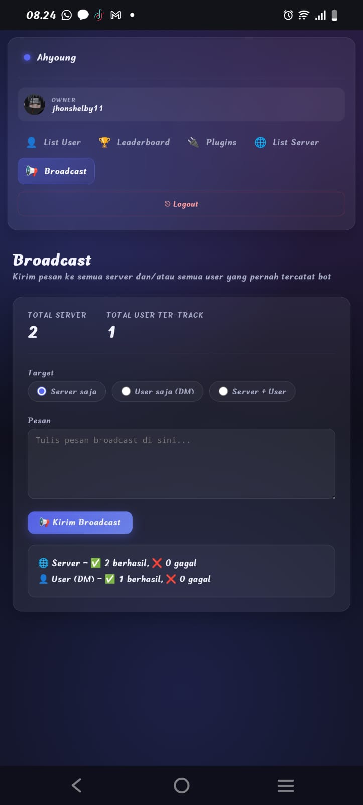
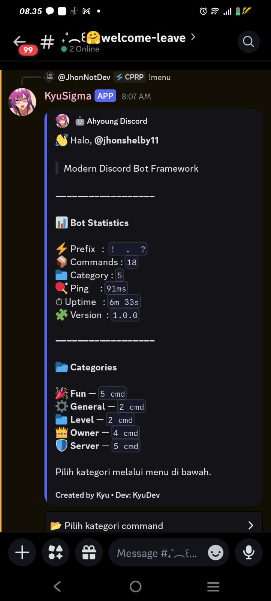
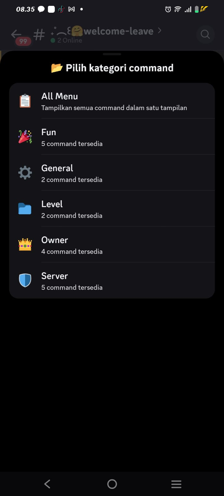
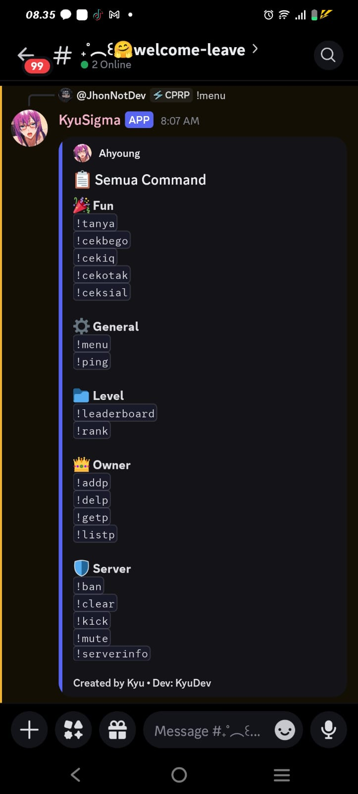

<div align="center">


<br/>
<br/>

# 🤖 Ahyoung Discord Bot Base

**Discord bot base ringan, modular, dan hot-reload — dibangun dengan Node.js ESM**

<br/>

[](https://nodejs.org)
[](https://discord.js.org)
[](package.json)
[](https://github.com/WiseLibs/better-sqlite3)
[](https://pm2.keymetrics.io)
[](#)
[](https://api.kyzzz.eu.cc)

<br/>

</div>

---

## ✨ Fitur Utama

- 🔌 **Plugin System** — load, reload, unload otomatis via `chokidar` (hot reload tanpa restart)
- ⚡ **Multi-Prefix** — `global.prefix` bisa string atau array banyak prefix sekaligus
- 📂 **Event System** — cukup drop file di `events/`, langsung aktif
- 🖥️ **CMD Logger** — setiap command dipakai user otomatis terlog di konsol
- 🎛️ **Global Config** — semua setting terpusat di `setting.js`
- 👑 **Owner Plugin Manager** — tambah, hapus, lihat plugin langsung dari Discord
- 🗂️ **Kategori Terstruktur** — General, Fun, Server, Owner, Level
- 📈 **Level System** — EXP dari chat, rank card & leaderboard dengan SQLite (`better-sqlite3`)
- 🎨 **Welcome & Leave Card** — banner otomatis via `canvacard` saat member join/leave
- 🖥️ **Web Dashboard** — dashboard owner-only (login via Discord OAuth2) buat lihat user, leaderboard, kelola plugin, list server, dan broadcast
- 🚇 **PM2 + Cloudflare Tunnel Ready** — `ecosystem.config.js` siap pakai, jalanin bot & tunnel bareng, auto-install `cloudflared` kalau belum ada
- 💬 **Menu Interaktif** — satu select menu berisi semua kategori + opsi **All Menu**
- 💌 **Guild + DM Ready** — command yang tidak butuh server otomatis bisa dipakai lewat DM
- 🌍 **Multi Platform** — Windows, Linux, macOS, WSL, hingga Termux

---

## 📋 Requirement

| Kebutuhan | Minimum |
|---|---|
| Node.js | `v18.0.0` ke atas (disarankan versi LTS terbaru) |
| npm | Terbawa otomatis bersama Node.js |
| Discord.js | `v14.16.3` (terpasang otomatis lewat `npm install`) |
| Git (opsional) | untuk clone repository |

Cek versi Node.js yang terpasang:

```bash
node -v
npm -v
```

---

## 🚀 Instalasi & Menjalankan Bot

Clone/download project terlebih dahulu, lalu ikuti panduan sesuai sistem operasi kamu.

```bash
git clone https://github.com/RynnStecu/ahyoung-dc
cd ahyoung-dc
```

### 🪟 Windows (CMD / PowerShell)

1. Install [Node.js](https://nodejs.org) (pilih versi LTS), lalu restart terminal.
2. Buka CMD atau PowerShell di folder project, lalu jalankan:

```powershell
npm install
npm start
```

> 💡 Jika warna/log di CMD tampil aneh, gunakan **Windows Terminal** atau **PowerShell 7+**, atau jalankan `chcp 65001` dulu supaya emoji & karakter unicode tampil normal.

### 🐧 Linux / Ubuntu Server / Debian

1. Install Node.js (contoh via NodeSource, sesuaikan versi):

```bash
curl -fsSL https://deb.nodesource.com/setup_20.x | sudo -E bash -
sudo apt install -y nodejs git
```

2. Install dependency & jalankan bot:

```bash
npm install
npm start
```

### 🍎 macOS

1. Install Node.js lewat [installer resmi](https://nodejs.org) atau via Homebrew:

```bash
brew install node git
```

2. Install dependency & jalankan bot:

```bash
npm install
npm start
```

### 🪟➡️🐧 Windows WSL

Ikuti panduan **Linux / Ubuntu / Debian** di atas setelah masuk ke distro WSL kamu (`wsl` dari CMD/PowerShell).

### 📱 Termux

```bash
pkg update
pkg upgrade
pkg install nodejs git
npm install
npm start
```

> 💡 Di Termux, jalankan `termux-wake-lock` supaya proses bot tidak dimatikan sistem saat layar terkunci.

---

## ⚙️ Konfigurasi

Edit file `setting.js` sebelum menjalankan bot:

```js
global.token    = "TOKEN_BOT_DISCORD"
global.clientId = "CLIENT_ID_BOT"
global.clientSecret = "CLIENT_SECRET_BOT" // dari Developer Portal, khusus login dashboard
global.guildId  = "ID_SERVER"
global.owner    = ["ID_DISCORD_KAMU"]

// Bisa satu prefix atau banyak prefix sekaligus
global.prefix   = ["!", ".", "?"]

global.botName  = "Ahyoung"
global.version  = "1.0.0"
global.embedColor = "#5865F2"
global.thumbnail  = "URL_GAMBAR"

global.devName     = "KyuDev"
global.devTelegram = "t.me/kyuugaperawan"
global.devWebsite  = "https://api.kyzzz.eu.cc"
global.devWhatsapp = "https://wa.me/6285881530884"

// Dashboard (khusus owner, login via Discord OAuth2)
global.dashboardConfig = {
  enabled: true,
  port: 3001,
  redirectUri: "http://localhost:3001/auth/discord/callback",
  sessionSecret: "STRING_ACAK_UNTUK_SESSION"
}
```

### 🔑 Cara Mendapatkan Bot Token

1. Buka [Discord Developer Portal](https://discord.com/developers/applications).
2. Klik **New Application**, beri nama bebas, lalu **Create**.
3. Masuk ke tab **Bot** di sidebar kiri → klik **Reset Token** / **Add Bot** → **Copy** token yang muncul.
4. Tempel token tersebut ke `global.token` di `setting.js`.
5. Di tab **Bot**, aktifkan **Message Content Intent** (wajib, karena bot ini pakai prefix command).
6. ⚠️ Jangan pernah membagikan token ke siapa pun — siapa saja yang punya token bisa mengontrol bot kamu sepenuhnya.

### 🆔 Cara Mendapatkan Client ID

1. Masih di [Developer Portal](https://discord.com/developers/applications), buka aplikasi bot kamu.
2. Masuk ke tab **General Information**.
3. Salin nilai **Application ID** — itulah `Client ID` yang dipakai untuk `global.clientId` dan link invite.

### 🔐 Cara Mendapatkan Client Secret & Setup Redirect URI (buat Dashboard)

1. Masih di [Developer Portal](https://discord.com/developers/applications), buka aplikasi bot kamu → tab **OAuth2**.
2. Di bagian **Client Information**, klik **Reset Secret** / **Copy** untuk menyalin **Client Secret** → tempel ke `global.clientSecret`.
3. Scroll ke **Redirects**, klik **Add Redirect**, isi persis sama dengan `global.dashboardConfig.redirectUri` (contoh: `http://localhost:3001/auth/discord/callback`), lalu **Save Changes**.
4. Kalau dashboard di-deploy pakai domain publik (via Cloudflare Tunnel dll), redirect URI harus disesuaikan ke domain itu (contoh: `https://dashboard.domainmu.com/auth/discord/callback`) — daftarkan juga URL itu di step 3.
5. ⚠️ Client Secret sama sensitifnya dengan bot token — jangan pernah dibagikan atau di-commit ke repo publik.

### ➕ Cara Invite Bot ke Server

1. Buka tab **OAuth2 → URL Generator** di Developer Portal.
2. Pilih scope: `bot`.
3. Pilih permission yang dibutuhkan (minimal: `Send Messages`, `Read Message History`, `Embed Links`; tambahkan `Ban Members`, `Kick Members`, `Moderate Members`, `Manage Messages` jika ingin memakai command moderasi).
4. Salin URL yang dihasilkan di bagian bawah, buka di browser, lalu pilih server tujuan.
5. Atau gunakan template URL langsung (ganti `CLIENT_ID`):

```
https://discord.com/oauth2/authorize?client_id=CLIENT_ID&scope=bot&permissions=8
```

---

## 📁 Struktur Project

```
ahyoung-dc/
├── plugins/
│   ├── general/
│   │   ├── menu.js
│   │   └── ping.js
│   ├── fun/
│   │   ├── tanya.js
│   │   ├── ceksial.js
│   │   ├── cekbego.js
│   │   ├── cekiq.js
│   │   └── cekotak.js
│   ├── ai/
│   │   └── tanya.js
│   ├── server/
│   │   ├── kick.js
│   │   ├── ban.js
│   │   ├── mute.js
│   │   ├── clear.js
│   │   └── serverinfo.js
│   ├── owner/
│   │   ├── addp.js
│   │   ├── delp.js
│   │   ├── getp.js
│   │   └── listp.js
│   └── level/
│       ├── rank.js
│       └── leaderboard.js
├── events/
│   ├── ready.js
│   ├── messageCreate.js
│   ├── interactionCreate.js
│   ├── guildMemberAdd.js
│   └── guildMemberRemove.js
├── handler/
│   └── pluginHandler.js
├── lib/
│   ├── banner.js
│   ├── loader.js
│   ├── logger.js
│   ├── utils.js
│   └── db.js
├── dashboard/
│   ├── server.js
│   ├── views/
│   │   ├── partials/
│   │   │   ├── head.ejs
│   │   │   └── sidebar.ejs
│   │   ├── login.ejs
│   │   ├── dashboard.ejs
│   │   ├── leaderboard.ejs
│   │   ├── plugins.ejs
│   │   ├── servers.ejs
│   │   ├── broadcast.ejs
│   │   └── 404.ejs
│   └── public/
│       ├── css/style.css
│       └── js/app.js
├── setting.js
├── index.js
├── ecosystem.config.js
├── scripts/
│   └── cloudflared-start.sh
├── docs/
│   └── screenshots/
│       ├── bot-menu-stats.jpg
│       ├── bot-menu-categories.jpg
│       ├── bot-menu-allcommand.jpg
│       ├── dashboard-list-user.jpg
│       ├── dashboard-leaderboard.jpg
│       ├── dashboard-plugins.jpg
│       ├── dashboard-servers.jpg
│       └── dashboard-broadcast.jpg
├── package.json
├── data.db
└── README.md
```

- **`plugins/`** — semua command bot, dikelompokkan per kategori (nama folder = kategori command).
- **`events/`** — event handler Discord.js (`ready`, `messageCreate`, `interactionCreate`, dst).
- **`handler/pluginHandler.js`** — loader + watcher plugin (hot reload via `chokidar`).
- **`lib/`** — utilitas bersama (embed, logger, banner, event loader).
- **`setting.js`** — semua konfigurasi global bot.

---

## 📋 Daftar Command

Command dengan tanda 🌐 bisa dipakai di **Server maupun DM**. Command dengan tanda 🛡️ **khusus Server** (butuh konteks guild seperti member/permission) dan tidak bisa dipakai lewat DM.

### ⚙️ General

| Command | Alias | Konteks | Deskripsi |
|---------|-------|---------|-----------|
| `!menu` | `!help` `!m` | 🌐 Server & DM | Menampilkan daftar command |
| `!ping` | `!p` | 🌐 Server & DM | Menampilkan latency bot |

### 🎉 Fun

| Command | Alias | Konteks | Deskripsi |
|---------|-------|---------|-----------|
| `!tanya` | `!ask` `!ai` | 🌐 Server & DM | Bertanya pada AI Assistant |
| `!ceksial` | `!sial` | 🌐 Server & DM | Cek seberapa sial seseorang |
| `!cekbego` | `!bego` `!bodoh` | 🌐 Server & DM | Cek seberapa bego seseorang |
| `!cekiq` | `!iq` | 🌐 Server & DM | Cek IQ seseorang |
| `!cekotak` | `!otak` `!cekpikiran` | 🌐 Server & DM | Cek apakah seseorang punya otak |

### 🛡️ Server *(khusus di dalam server)*

| Command | Alias | Konteks | Deskripsi |
|---------|-------|---------|-----------|
| `!kick` | `!keluarin` | 🛡️ Server saja | Kick member dari server |
| `!ban` | `!blokir` | 🛡️ Server saja | Ban member dari server |
| `!mute` | `!timeout` `!diam` | 🛡️ Server saja | Timeout member (`!mute @user 10m alasan`) |
| `!clear` | `!purge` `!hapuspesan` | 🛡️ Server saja | Hapus pesan massal 1–100 |
| `!serverinfo` | `!sinfo` `!server` | 🛡️ Server saja | Info lengkap server |

### 👑 Owner *(khusus owner)*

| Command | Alias | Konteks | Deskripsi |
|---------|-------|---------|-----------|
| `!addp` | `!addplugin` | 🌐 Server & DM | Tambah plugin baru via menu interaktif |
| `!delp` | `!delplugin` | 🌐 Server & DM | Hapus plugin dari disk |
| `!getp` | `!getplugin` `!srcp` | 🌐 Server & DM | Lihat source code plugin |
| `!listp` | `!listplugin` `!plugins` | 🌐 Server & DM | Daftar semua plugin + status |

### 📈 Level *(khusus di dalam server)*

| Command | Alias | Konteks | Deskripsi |
|---------|-------|---------|-----------|
| `!rank` | `!profile` `!level` | 🛡️ Server saja | Rank card kamu atau user yang di-mention |
| `!leaderboard` | `!lb` `!top` | 🛡️ Server saja | Top 10 level di server |

---

## 📈 Level System

Bot menyimpan XP per user (per server) di SQLite lokal (`data.db`, otomatis dibuat via `better-sqlite3`), tidak butuh setup database eksternal.

- Setiap pesan yang dikirim user memberi **10–25 XP acak**, dengan **cooldown per user** (default 45 detik) supaya tidak bisa di-spam untuk naik level cepat.
- Rumus XP yang dibutuhkan tiap level: `300 * 2^level` (level makin tinggi, XP dibutuhkan makin banyak).
- `!rank` menampilkan rank card visual (via `canvacard`) berisi avatar, level, XP, progress bar, dan posisi rank di server.
- `!leaderboard` menampilkan top 10 user dengan level & XP tertinggi, lengkap medali 🥇🥈🥉 untuk 3 besar.
- Semua helper database (`getUser`, `saveUser`, `addXP`, `getLeaderboard`, `getRequiredXP`) ada di `lib/db.js` dan bisa dipakai ulang dari plugin lain.

Konfigurasi level diatur di `setting.js`:

```js
global.levelConfig = {
  xpCooldown: 45,   // detik cooldown per user antar pesan yang dihitung XP
  xpMin: 10,        // XP minimum per pesan
  xpMax: 25         // XP maksimum per pesan
}
```

### 🎉 Welcome & Leave Card

Saat member join/keluar server, bot mengirim **banner image** otomatis (dibuat via `canvacard`) ke channel yang ditentukan.

```js
global.welcomeChannelId = "ID_CHANNEL_WELCOME"
global.leaveChannelId   = "ID_CHANNEL_LEAVE"   // kosongkan jika mau sama dengan welcome
global.logChannelId     = "ID_CHANNEL_LOG"     // opsional, untuk log level up dll

global.welcomeConfig = {
  background: "URL_GAMBAR_BACKGROUND",
  overlayColor: "#5865F2",
  circleColor: "#FFFFFF",
  textColor: "#FFFFFF"
}

global.leaveConfig = {
  background: "URL_GAMBAR_BACKGROUND",
  overlayColor: "#2c2f33",
  circleColor: "#FFFFFF",
  textColor: "#FFFFFF"
}
```

Jika `welcomeChannelId` / `leaveChannelId` dikosongkan, event tetap berjalan tapi tidak mengirim pesan (aman, tidak error).

---

## 🖥️ Web Dashboard

Dashboard web ringan (**Express + EJS**, tanpa React/build-step) buat kelola bot dari browser. **Khusus owner** — login pakai akun Discord lewat OAuth2, dicek langsung ke `global.owner`. Kalau akun yang login bukan owner, otomatis ditolak walau tetap berhasil login ke Discord.

Jalankan bareng bot (satu proses `npm start`), default di port `3001` (bisa diubah di `dashboardConfig.port`).

| Halaman | URL | Isi |
|---|---|---|
| List User | `/dashboard` | Overview stats (server, user ter-track, plugin, ping) + table user & level per server |
| Leaderboard | `/leaderboard` | Top 10 ranking per server, medali 🥇🥈🥉 untuk 3 besar |
| Plugins | `/plugins` | List semua plugin + status (aktif/gagal), tambah plugin baru, lihat source, hapus plugin |
| List Server | `/servers` | Card semua server bot ada — icon, jumlah member, owner server |
| Broadcast | `/broadcast` | Kirim pesan ke semua server (channel utama tiap server) dan/atau DM ke semua user ter-track |

### 📸 Preview

<div align="center">
<table>
<tr>
<td><br/><sub>List User</sub></td>
<td><br/><sub>Leaderboard</sub></td>
</tr>
<tr>
<td><br/><sub>Plugins</sub></td>
<td><br/><sub>List Server</sub></td>
</tr>
<tr>
<td colspan="2"><br/><sub>Broadcast</sub></td>
</tr>
</table>
</div>

### Setup

1. Isi `global.clientSecret` dan `global.dashboardConfig.redirectUri` di `setting.js` (lihat [Cara Mendapatkan Client Secret](#-cara-mendapatkan-client-secret--setup-redirect-uri-buat-dashboard) di atas).
2. Ganti `global.dashboardConfig.sessionSecret` dengan string acak (buat enkripsi cookie session).
3. Jalankan bot seperti biasa (`npm start`) — dashboard otomatis ikut jalan setelah bot berhasil login.
4. Buka `http://localhost:3001` (atau domain yang kamu tunnel), klik **Login with Discord**, login pakai akun yang ada di `global.owner`.

### Cara Kerja Tambah/Hapus Plugin dari Dashboard

Menulis/menghapus file langsung di `plugins/<kategori>/<nama>.js`, jadi otomatis kepick sama **plugin watcher** (`chokidar`) yang sama dipakai command `!addp`/`!delp` — nggak perlu restart bot. Kalau nama plugin sudah ada, dashboard bakal nanya konfirmasi timpa dulu sebelum overwrite.

### Cara Kerja Broadcast

- **Ke server**: kirim ke `systemChannel` tiap server (atau channel text pertama yang bot punya izin `Send Messages`-nya) jika `systemChannel` tidak ada/tidak bisa dikirimi.
- **Ke user**: DM satu per satu ke semua `userId` yang pernah tercatat di sistem level (lintas server). User yang DM-nya ketutup otomatis kehitung "gagal", tidak bikin proses berhenti.
- Ada delay ~400ms antar pengiriman buat menghindari rate limit Discord. Hasil (berhasil/gagal) ditampilkan setelah broadcast selesai.

> ⚠️ Dashboard tidak punya proteksi rate-limit/firewall bawaan di levelnya sendiri. Kalau di-expose ke publik (misal via Cloudflare Tunnel), pastikan tetap aman karena satu-satunya gerbang masuk adalah pengecekan `global.owner` — jangan sampai `clientSecret` atau `sessionSecret` bocor.

---

## 🚇 Jalankan dengan PM2 + Cloudflare Tunnel

`ecosystem.config.js` sudah disiapkan buat menjalankan **bot** dan **Cloudflare Tunnel** sekaligus lewat PM2 — satu perintah, dua proses, auto-restart kalau salah satu crash.

### Setup Tunnel (sekali saja)

1. Buka [Cloudflare Zero Trust Dashboard](https://one.dash.cloudflare.com) → **Networks → Tunnels → Create a tunnel**.
2. Pilih **Cloudflared**, kasih nama tunnel (misal `ahyoung-dashboard`), lanjut ke step **Install connector**.
3. Di step itu ada perintah `cloudflared service install <TOKEN>` — **jangan dijalankan**, cukup salin nilai `<TOKEN>` di paling belakang perintah itu.
4. Lanjut ke step **Public Hostname**, isi:
   - **Subdomain**: `dashboard` (atau sesuai selera)
   - **Domain**: pilih domain kamu (misal `kyzzz.eu.cc`)
   - **Service Type**: `HTTP`
   - **URL**: `localhost:3001`
5. Klik **Save tunnel**. Hostname `dashboard.kyzzz.eu.cc` sekarang otomatis diarahkan ke dashboard lokal kamu — nggak perlu edit `config.yml` manual karena tunnel jenis token dikelola dari dashboard Cloudflare.

### Isi Token ke Ecosystem

Buka `ecosystem.config.js`, ganti token di app `ahyoung-tunnel`:

```js
env: {
  TUNNEL_TOKEN: "TOKEN_DARI_CLOUDFLARE_ZERO_TRUST"
}
```

### Update Redirect URI Dashboard

Karena dashboard sekarang punya domain publik, update juga `setting.js`:

```js
global.dashboardConfig.redirectUri = "https://dashboard.kyzzz.eu.cc/auth/discord/callback"
```

Lalu daftarkan URL yang sama persis di Developer Portal → OAuth2 → Redirects (lihat [bagian Client Secret](#-cara-mendapatkan-client-secret--setup-redirect-uri-buat-dashboard) di atas).

### Jalankan

```bash
npm run pm2:start     # start bot + tunnel
npm run pm2:logs      # lihat log kedua proses
npm run pm2:restart   # restart keduanya (misal setelah ganti setting.js)
npm run pm2:stop      # stop keduanya
pm2 save              # simpan process list biar auto-start lagi kalau server reboot
pm2 startup           # (sekali saja) daftarkan pm2 supaya jalan otomatis saat boot
```

Proses `ahyoung-tunnel` otomatis **install `cloudflared`** sendiri kalau belum ada di sistem (support Termux via `pkg`, dan Debian/Ubuntu via `.deb`) — jadi di VPS baru pun tinggal `npm run pm2:start` langsung jalan tanpa install manual dulu.

> Kalau OS kamu bukan Termux/Debian-based (misal Alpine, Arch, dsb), install `cloudflared` manual dulu dari [halaman release resmi](https://github.com/cloudflare/cloudflared/releases) — script auto-install cuma cover dua platform itu.

---

## 💬 Menu Interaktif

`!menu` menampilkan satu **select menu** berisi seluruh kategori command, termasuk opsi **📋 All Menu** di paling atas untuk melihat semua command sekaligus dalam satu tampilan.

- Memilih salah satu **kategori** → menampilkan command di kategori itu lengkap dengan alias-nya.
- Memilih **All Menu** → menampilkan seluruh command dari semua kategori, tapi **hanya command utama (primary command)** yang ditampilkan, alias disembunyikan supaya ringkas. Alias tetap berfungsi seperti biasa saat dipakai langsung di chat.
- Kategori **Owner** hanya muncul/bisa dipilih oleh user yang terdaftar di `global.owner`.

### 📸 Preview

<div align="center">
<table>
<tr>
<td><br/><sub>!menu — Bot Statistics</sub></td>
<td><br/><sub>Pilih Kategori Command</sub></td>
<td><br/><sub>All Menu — Semua Command</sub></td>
</tr>
</table>
</div>

---

## 💌 Dukungan Guild & DM

Bot ini bisa dipakai baik di dalam **server (guild)** maupun lewat **Private Message (DM)**.

- Command yang tidak bergantung pada data server (contoh: `menu`, `ping`, `tanya`, semua command `fun`, dan command `owner`) bisa langsung dipakai di DM.
- Command yang butuh konteks server (contoh: `ban`, `kick`, `mute`, `clear`, `serverinfo`) ditandai `guildOnly: true` pada definisi plugin-nya. Jika dipanggil lewat DM, bot akan membalas pesan penolakan alih-alih error/crash.
- Menandai plugin baru sebagai khusus server cukup tambahkan properti berikut di plugin:

```js
export default {
  name: "contoh",
  category: "Server",
  guildOnly: true, // hanya bisa dipakai di dalam server
  async run({ message }) { /* ... */ }
}
```

---

## 🖥️ CMD Logger

Setiap kali ada user pakai command, konsol otomatis print:

```
────────────────────────────────────────
[ CMD USED ]
Bot     : Ahyoung
User    : username#0
ID      : 123456789012345678
CMD     : !ping
Time    : 24/07/2026, 12:00:00
────────────────────────────────────────
```

Warna log dirender menggunakan `chalk`, sehingga otomatis menyesuaikan (atau nonaktif) berdasarkan dukungan terminal — aman dipakai di CMD, PowerShell, terminal Linux/macOS, maupun Termux.

---

## ⚡ Multi-Prefix

```js
// Single
global.prefix = "!"

// Array — semua prefix aktif bersamaan
global.prefix = ["!", ".", "?"]
```

Di dalam plugin, prefix yang dipakai user tersedia via `usedPrefix`:

```js
async run({ client, message, args, usedPrefix }) {
  await message.reply(`Kamu pakai prefix: ${usedPrefix}`)
}
```

---

## 🔌 Cara Membuat Plugin Baru

Drop file `.js` di subfolder kategori mana saja dalam `plugins/` (atau buat folder kategori baru). Bot langsung load tanpa restart berkat hot reload.

```js
export default {
  name: "hello",
  aliases: ["hi", "halo"],
  category: "General",
  description: "Contoh command",
  guildOnly: false, // opsional, set true jika command butuh konteks server

  async run({ client, message, args, usedPrefix }) {
    await message.reply(`Halo dari ${usedPrefix}hello!`)
  }
}
```

Field yang wajib ada: `name` (string) dan `run` (async function). Field lain (`aliases`, `category`, `description`, `guildOnly`) bersifat opsional tapi disarankan diisi supaya tampil rapi di menu.

## 🔄 Cara Reload Plugin

Plugin di-reload otomatis, tidak perlu restart bot maupun ketik command apa pun:

- **Edit file plugin** yang sudah ada → otomatis re-import & terdaftar ulang (`chokidar` mendeteksi perubahan file).
- **Tambah file baru** di `plugins/` → otomatis ter-load sebagai plugin baru.
- **Hapus file plugin** → otomatis ter-unregister dari `client.plugins` dan `client.aliases`.
- Semua proses ini tercatat di konsol (`Plugin dimuat`, `Plugin di-reload`, `Plugin dihapus`).

Alternatif manual dari dalam Discord (khusus owner): `!addp`, `!delp`, `!getp`, `!listp`.

---

## 👑 Owner Plugin Manager

### `!addp` — Tambah Plugin (Interaktif)

1. Ketik `!addp`
2. Pilih **kategori** dari dropdown
3. Kirim **nama plugin**
4. Kirim **code** dalam code block atau attach file `.js`

Jika plugin sudah ada, muncul tombol konfirmasi **Timpa** atau **Batal**.

Shortcut langsung:

````
!addp general/hello
```js
export default {
  name: "hello",
  aliases: [],
  category: "General",
  description: "Halo dunia",
  async run({ message }) {
    await message.reply("Halo!")
  }
}
```
````

### `!delp <nama>` — Hapus Plugin
### `!getp <nama>` — Ambil Source Code
### `!listp` — List Semua Plugin + Status

---

## 📡 Membuat Event Baru

```js
// events/guildMemberAdd.js
export default {
  name: "guildMemberAdd",
  once: false,
  async execute(client, member) {
    console.log(`${member.user.tag} bergabung`)
  }
}
```

---

## 🛠️ Troubleshooting

| Masalah | Kemungkinan Penyebab & Solusi |
|---|---|
| Bot tidak merespon command apa pun | Pastikan **Message Content Intent** sudah diaktifkan di Developer Portal (tab Bot), dan token/prefix di `setting.js` sudah benar. |
| `Gagal menjalankan bot: An invalid token was provided` | Token di `global.token` salah/sudah di-reset. Ambil token baru dari Developer Portal. |
| Command server (`ban`, `kick`, dst) tidak jalan di DM | Ini memang disengaja — command tersebut `guildOnly: true` karena butuh data server. Gunakan di dalam server. |
| Emoji/warna log tampil aneh di Windows CMD | Gunakan Windows Terminal atau PowerShell 7+, atau jalankan `chcp 65001` sebelum `npm start`. |
| Plugin baru tidak ke-load | Pastikan file plugin ada di dalam `plugins/<kategori>/`, memiliki `export default` dengan `name` (string) dan `run` (async function), lalu cek log error di konsol. |
| `EADDRINUSE` atau proses nyangkut (Termux) | Hentikan proses lama dengan `pkill -f "node ."` lalu jalankan ulang `npm start`. |
| `npm install` gagal | Pastikan Node.js `>=18`, koneksi internet stabil, dan coba hapus `node_modules` + `package-lock.json` lalu ulangi `npm install`. |
| Bot online tapi tombol/menu tidak merespon | Pastikan bot punya permission **Embed Links** dan intent **Guilds** aktif; cek juga log error di konsol saat interaksi dipakai. |
| Dashboard: klik "Login with Discord" tapi balik ke `/login` dengan error | Cek `global.dashboardConfig.redirectUri` di `setting.js` sama persis (termasuk `http`/`https` dan trailing path) dengan yang didaftarkan di Developer Portal → OAuth2 → Redirects. |
| Dashboard: "Akun ini bukan owner bot. Akses ditolak." | ID Discord kamu belum ada di `global.owner`. Tambahkan ID kamu ke array itu di `setting.js`, lalu restart bot. |
| Dashboard tidak bisa diakses / connection refused | Pastikan `dashboardConfig.enabled` bernilai `true` dan port yang dipakai (`dashboardConfig.port`) tidak bentrok dengan service lain. |
| Broadcast ke server gagal semua | Bot kemungkinan tidak punya permission `Send Messages` di channel manapun pada server itu — cek permission role bot di server tujuan. |
| `pm2 start ecosystem.config.js` gagal jalanin tunnel | Cek `pm2 logs ahyoung-tunnel` — biasanya karena `TUNNEL_TOKEN` belum diisi/salah, atau OS tidak didukung script auto-install (lihat catatan di bagian PM2 + Tunnel). |
| Tunnel jalan tapi dashboard tetap tidak bisa diakses dari domain publik | Cek **Public Hostname** di Cloudflare Zero Trust sudah mengarah ke `localhost:3001` (port yang sama dengan `dashboardConfig.port`), dan proses `ahyoung-bot` (yang menjalankan dashboard) juga sedang aktif. |

---

## 📌 Catatan Developer

- `client.plugins` — Map semua plugin aktif (key: nama plugin)
- `client.aliases` — Map alias → nama plugin asli
- `createEmbed()` dari `lib/utils.js` untuk embed dengan tema default
- `logger.cmd()` dari `lib/logger.js` untuk log manual jika perlu
- `plugin.guildOnly` — set `true` supaya command otomatis ditolak saat dipakai lewat DM
- `getUser()`, `saveUser()`, `addXP()`, `getLeaderboard()`, `getRequiredXP()` dari `lib/db.js` — helper level system, aman dipakai dari plugin manapun
- File `data.db` dibuat otomatis di root project saat bot pertama kali start — jangan commit file ini ke git (tambahkan ke `.gitignore`)
- `dashboard/server.js` mengekspor `createDashboard(client)` — dipanggil sekali di `index.js` setelah `client.login()` berhasil
- Route dashboard yang butuh login pakai middleware `requireAuth`, yang cuma mengecek `req.session.discordUser.id` ada di `global.owner`, bukan role Discord di server manapun

---

<div align="center">

## 👤 Developer

**KyuDev**

[](https://t.me/kyuugaperawan)
[](https://wa.me/6285881530884)
[](https://api.kyzzz.eu.cc)
[](https://github.com/RynnStecu)

<br/>

### 📢 WhatsApp Channel

[](https://whatsapp.com/channel/0029Vb7gcbuLdQelWzrTzD3D)
[](https://whatsapp.com/channel/0029VbCsmdMC1Fu6NbIaaY2T)

<br/>

> **Not for sale • Keep this credit**

<br/>

*Created with ❤️ by KyuDev*

</div>
